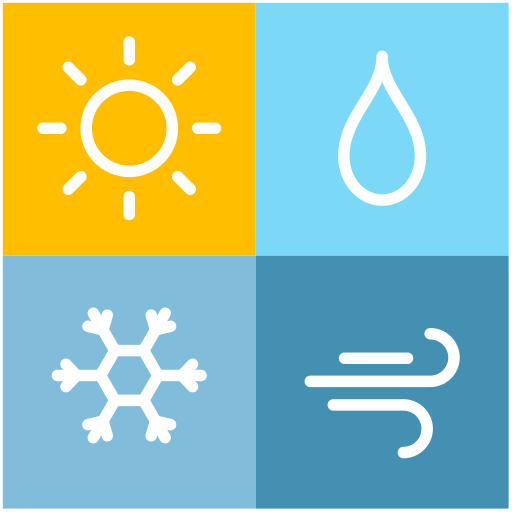
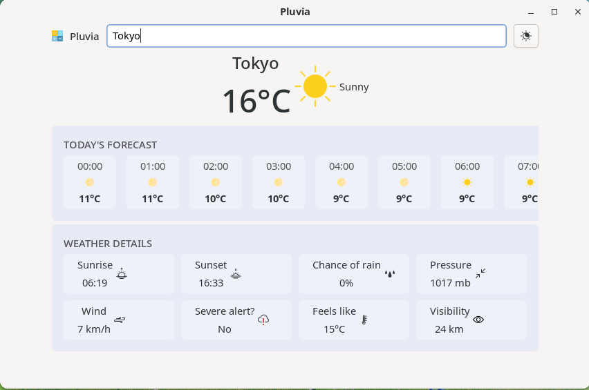
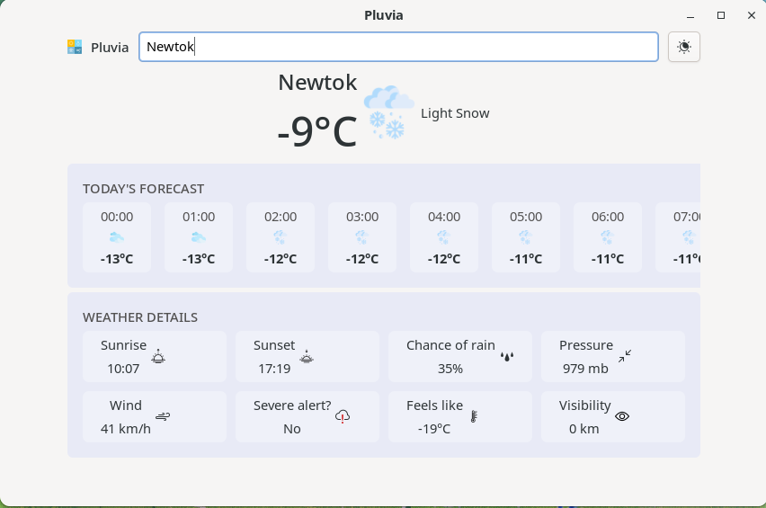

  

# Pluvia

A lightweight weather application built with GTK4.

## Features 

Pluvia currently supports:

- Temperature (°C)
- Feels like (°C)
- Pressure (mb)
- Wind speed (km/h)
- Visibility
- Chance of rain (%)
- Hour-by-hour forecast from 00:00 to 23:00
- Quick visual representation for each hour (icons, temperature, conditions)
- Sunrise time
- Sunset time

---

## Screenshots

  

  

---

## Technical Notes

- Built entirely with GTK4.
- Weather data fetched from the Open-Meteo API.
- All requests are performed asynchronously using GTask, ensuring the UI remains smooth and responsive.
- Designed to run efficiently even on low-resource machines.

## Build

- Ensure you have GTK4 installed on your machine.
- Run the `cc.sh` script.
- Execute the binary inside the `build/` directory.

## Releases 

- Soon.

